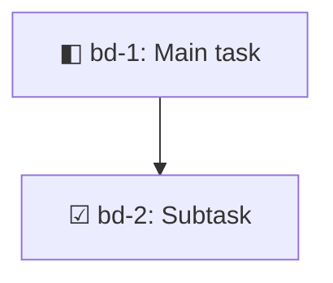

Manage dependencies between beads issues.

## Available Commands

- **add**: Add a dependency between issues
  - $1: "add"
  - $2: From issue ID
  - $3: To issue ID
  - $4: Dependency type (blocks, related, parent-child, discovered-from)

- **remove**: Remove a dependency
  - $1: "remove"
  - $2: From issue ID
  - $3: To issue ID

- **tree**: Show dependency tree for an issue
  - $1: "tree"
  - $2: Issue ID
  - Flags:
    - `--reverse`: Show dependent tree (what was discovered from this) instead of dependency tree (what blocks this)
    - `--format mermaid`: Output as Mermaid.js flowchart (renders in GitHub/GitLab markdown)
    - `--json`: Output as JSON
    - `--max-depth N`: Limit tree depth (default: 50)
    - `--show-all-paths`: Show all paths (no deduplication for diamond dependencies)

- **cycles**: Detect dependency cycles

## Dependency Types

- **blocks**: Hard blocker (from blocks to) - affects ready queue
- **related**: Soft relationship - for context only
- **parent-child**: Epic/subtask relationship
- **discovered-from**: Track issues found during work

## Mermaid Format

The `--format mermaid` option outputs the dependency tree as a Mermaid.js flowchart:

**Example:**
```bash
bd dep tree bd-1 --format mermaid
```

Output can be embedded in markdown:

````markdown

````

**Status Indicators:**

Each node includes a symbol indicator for quick visual status identification:

- ☐ **Open** - Not started yet (empty checkbox)
- ◧ **In Progress** - Currently being worked on (half-filled box)
- ⚠ **Blocked** - Waiting on something (warning sign)
- ☑ **Closed** - Completed! (checked checkbox)

The diagram colors are determined by your Mermaid theme (default, dark, forest, neutral, or base). Mermaid diagrams render natively in GitHub, GitLab, VSCode markdown preview, and can be imported to Miro.

## Examples

- `bd dep add bd-10 bd-20 --type blocks`: bd-10 blocks bd-20
- `bd dep tree bd-20`: Show what blocks bd-20 (dependency tree going UP)
- `bd dep tree bd-1 --reverse`: Show what was discovered from bd-1 (dependent tree going DOWN)
- `bd dep tree bd-1 --reverse --max-depth 3`: Show discovery tree with depth limit
- `bd dep tree bd-20 --format mermaid > tree.md`: Generate Mermaid diagram for documentation
- `bd dep cycles`: Check for circular dependencies

## Reverse Mode: Discovery Trees

The `--reverse` flag inverts the tree direction to show **dependents** instead of **dependencies**:

**Normal mode** (`bd dep tree ISSUE`):
- Shows what blocks you (dependency tree)
- Answers: "What must I complete before I can work on this?"
- Tree flows **UP** toward prerequisites

**Reverse mode** (`bd dep tree ISSUE --reverse`):
- Shows what was discovered from you (dependent tree)
- Answers: "What work was discovered while working on this?"
- Tree flows **DOWN** from goal to discovered tasks
- Perfect for visualizing work breakdown and discovery chains

**Use Cases:**
- Document project evolution and how work expanded from initial goal
- Share "how we got here" context with stakeholders
- Visualize work breakdown structure from epics
- Track discovery chains (what led to what)
- Show yak shaving journeys in retrospectives
